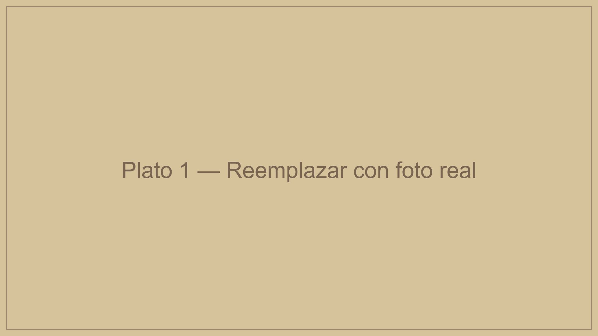
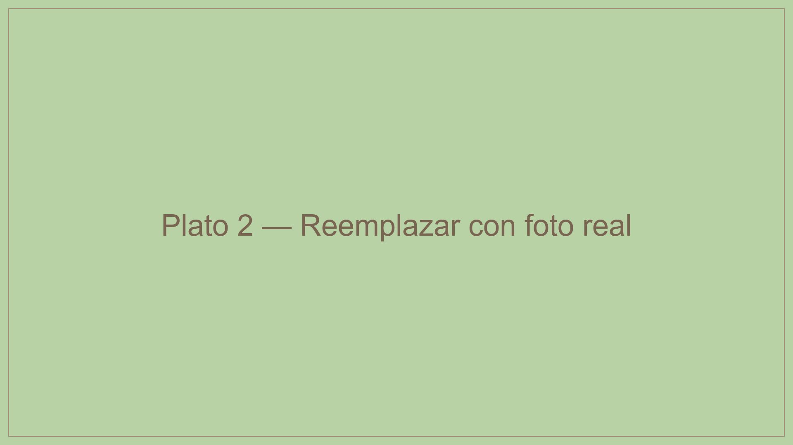
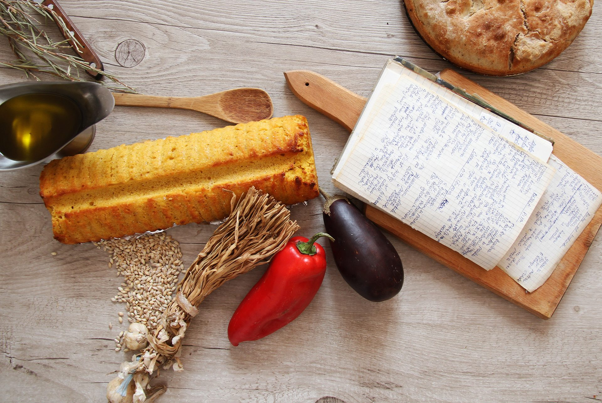

# Manual de Usuario — Nelsmari Sous Vide Website

## Tabla de Contenidos

1. [Estructura del sitio](#1-estructura-del-sitio)
2. [Imagenes del Hero (pagina principal)](#2-imagenes-del-hero-pagina-principal)
3. [Imagenes de productos](#3-imagenes-de-productos)
4. [Editar el menu (products.csv)](#4-editar-el-menu-productscsv)
5. [Combos y promociones](#5-combos-y-promociones)
6. [Cambiar el logo](#6-cambiar-el-logo)
7. [Como publicar cambios](#7-como-publicar-cambios)

---

## 1. Estructura del sitio

```
nelsmari.com/
|
|-- index.html                  <- Pagina principal (home)
|-- products.csv                <- BASE DE DATOS del menu (todos los platos)
|-- assets/
|   |-- css/style.css           <- Estilos visuales
|   |-- js/                     <- Logica del sitio
|   |-- img/
|       |-- hero/               <- Fotos del slideshow principal
|       |   |-- hero-1.jpg
|       |   |-- hero-2.jpg
|       |   |-- hero-3.jpg
|       |-- products/           <- Fotos de cada plato (miniatura + grande)
|       |-- ui/                 <- Logo, favicon, og-image
|-- sous-vide/
    |-- index.html              <- Pagina del menu completo
    |-- checkout.html           <- Pagina del carrito / pedido
    |-- producto/index.html     <- Detalle de cada producto
    |-- como-calentar.html      <- Guia de calentamiento
    |-- seguridad.html          <- Seguridad y empaque
    |-- zonas.html              <- Mapa de zonas de entrega
    |-- nosotros.html           <- Sobre nosotros
```

---

## 2. Imagenes del Hero (pagina principal)

El hero es la seccion grande al inicio de la pagina principal. Tiene un **slideshow** de fotos que rotan automaticamente cada 5 segundos con una transicion suave.

### Donde estan las imagenes

```
assets/img/hero/
  hero-1.jpg    <- Primera imagen
  hero-2.jpg    <- Segunda imagen
  hero-3.jpg    <- Tercera imagen
```

Las fotos actuales son:

**hero-1.jpg** — Ingredientes frescos (vista cenital)


**hero-2.jpg** — Mesa con platos preparados


**hero-3.jpg** — Ingredientes y pan artesanal


### Como cambiar las fotos del hero

1. Prepara las fotos nuevas:
   - **Tamano recomendado:** 1920 x 1080 px (horizontal)
   - **Formato:** JPG
   - **Peso ideal:** menos de 500KB cada una
   - **Tip:** Fotos de platos, ingredientes o proceso de preparacion funcionan muy bien

2. Renombra las fotos como `hero-1.jpg`, `hero-2.jpg`, `hero-3.jpg`

3. Reemplaza los archivos en la carpeta `assets/img/hero/`

4. Publica los cambios (ver seccion 7)

### Como agregar o quitar fotos del slideshow

Si quieres **agregar** una cuarta foto:

1. Coloca la imagen en `assets/img/hero/hero-4.jpg`
2. Abre `index.html` y busca esta seccion:

```html
<div class="hero__slideshow" id="hero-slideshow">
  <div class="hero__slide is-active" style="background-image: url('/assets/img/hero/hero-1.jpg');"></div>
  <div class="hero__slide" style="background-image: url('/assets/img/hero/hero-2.jpg');"></div>
  <div class="hero__slide" style="background-image: url('/assets/img/hero/hero-3.jpg');"></div>
</div>
```

3. Agrega una linea nueva antes del `</div>` de cierre:

```html
  <div class="hero__slide" style="background-image: url('/assets/img/hero/hero-4.jpg');"></div>
```

Para **quitar** una foto, elimina la linea `<div class="hero__slide"...>` correspondiente y borra el archivo.

> **Nota:** La primera imagen siempre debe tener la clase `is-active`.

---

## 3. Imagenes de productos

Cada producto usa **2 imagenes**:

| Tipo | Uso | Tamano recomendado | Nombre ejemplo |
|------|-----|-------------------|----------------|
| **Miniatura** (`-thumb.jpg`) | Cards del menu y checkout | 400 x 300 px | `arroz-chaufa-thumb.jpg` |
| **Grande** (`.jpg`) | Pagina de detalle del producto | 800 x 600 px | `arroz-chaufa.jpg` |

### Donde van

```
assets/img/products/
  salon-vaca-demi-glace-thumb.jpg     <- miniatura
  salon-vaca-demi-glace.jpg           <- grande
  filete-pollo-naranja-thumb.jpg
  filete-pollo-naranja.jpg
  ... (un par por cada producto)
```

### Como agregar fotos a un producto

1. Toma o edita la foto del plato
2. Crea 2 versiones:
   - **Grande:** redimensiona a ~800px de ancho, guarda como `[id-del-producto].jpg`
   - **Miniatura:** redimensiona a ~400px de ancho, guarda como `[id-del-producto]-thumb.jpg`
3. Coloca ambas en `assets/img/products/`
4. El nombre debe coincidir **exactamente** con lo que dice `products.csv` en las columnas `imagen_miniatura` e `imagen_grande`

### Que pasa si no hay foto

Si un producto no tiene foto, se muestra un **placeholder** automatico con el nombre del plato sobre un fondo beige. No se rompe nada.

---

## 4. Editar el menu (products.csv)

El archivo `products.csv` es **la base de datos de todo el menu**. Es un archivo de texto separado por comas que puedes abrir con Excel, Google Sheets, o cualquier editor de texto.

### Donde esta

```
products.csv    <- en la raiz del proyecto
```

### Estructura de columnas

Cada fila es un producto. Las columnas son:

| Columna | Descripcion | Ejemplo | Notas |
|---------|-------------|---------|-------|
| `id` | Identificador unico | `arroz-chaufa` | Sin espacios, sin tildes, usa guiones |
| `categoria` | Tipo de plato | `proteinas` | Solo: `proteinas`, `carbohidratos`, o `vegetales` |
| `nombre` | Nombre visible | `Arroz chaufa` | Como aparece en el sitio |
| `precio` | Precio unitario | `3.25` | Usar punto decimal, sin signo $ |
| `descripcion_corta` | Texto para las cards | `Arroz salteado al wok...` | 1 linea, ~60 caracteres |
| `descripcion_larga` | Texto para la pagina detalle | `Arroz salteado al wok con...` | Puede ser mas largo |
| `imagen_miniatura` | Nombre del archivo thumb | `arroz-chaufa-thumb.jpg` | Debe existir en `assets/img/products/` |
| `imagen_grande` | Nombre del archivo grande | `arroz-chaufa.jpg` | Debe existir en `assets/img/products/` |
| `disponible` | Visible en el menu? | `true` o `false` | `false` lo oculta sin borrarlo |
| `calorias` | Kcal por porcion | `280` | Solo numero |
| `proteinas_g` | Gramos de proteina | `6` | Solo numero |
| `carbohidratos_g` | Gramos de carbos | `48` | Solo numero |
| `grasas_g` | Gramos de grasa | `8` | Solo numero |
| `alergeno_mariscos` | Contiene mariscos? | `true` o `false` | |
| `alergeno_gluten` | Contiene gluten? | `true` o `false` | |
| `alergeno_lacteos` | Contiene lacteos? | `true` o `false` | |
| `destacado` | Aparece en la pagina principal? | `true` o `false` | Maximo 4 recomendado |

### Ejemplo de una fila

```
arroz-chaufa,carbohidratos,Arroz chaufa,1.25,Arroz salteado al wok estilo chaufa con vegetales.,Arroz salteado al wok con vegetales frescos y salsa de soya...,arroz-chaufa-thumb.jpg,arroz-chaufa.jpg,true,280,6,48,8,false,true,false,false
```

### Como agregar un nuevo producto

1. Abre `products.csv` con Excel o Google Sheets
2. Agrega una fila nueva al final
3. Llena todas las columnas (no dejes ninguna vacia)
4. Asegurate de que el `id` sea unico y no tenga espacios ni caracteres especiales
5. Agrega las fotos correspondientes en `assets/img/products/`
6. Publica los cambios

### Como quitar un producto del menu

**Opcion A — Ocultar (recomendado):** Cambia `disponible` de `true` a `false`. El producto desaparece del menu pero se puede reactivar facilmente.

**Opcion B — Eliminar:** Borra la fila completa del CSV.

### Como cambiar un precio

Busca la fila del producto y modifica el valor en la columna `precio`. Ejemplo: cambiar `3.25` a `3.50`.

> **IMPORTANTE al editar con Excel:**
> - Guarda siempre como CSV (no como .xlsx)
> - Usa codificacion UTF-8 para que las tildes se vean bien
> - No agregues comillas extra ni cambies el formato

### Productos destacados (pagina principal)

Los productos con `destacado` = `true` aparecen en la seccion "Nuestros platos destacados" de la pagina principal. Actualmente hay 4:

1. Salon de vaca demi-glace
2. Filete de pollo naranja
3. Pesca blanca en salsa de mariscos
4. Camarones pomodoro

Para cambiar cuales aparecen, simplemente cambia `true`/`false` en la columna `destacado`.

---

## 5. Combos y promociones

Los combos se calculan **automaticamente** cuando el cliente agrega productos al carrito. No necesitas hacer nada para activarlos.

### Combos activos

| Combo | Contenido | Precio normal | Precio combo | Ahorro |
|-------|-----------|:------------:|:------------:|:------:|
| **Combo Balanceado** | 1 proteina + 1 carbohidrato + 1 vegetal | $5,50 | **$5,00** | $0,50 |
| **Combo Nelsmari** | 5 proteinas + 5 carbohidratos + 5 vegetales | $27,50 | **$24,00** | $3,50 |
| **Promo Lanzamiento** | Compra 4 proteinas → 1 vegetal gratis | — | — | $1,00 |

### Como funciona la deteccion

1. El sistema cuenta cuantos items de cada categoria tiene el carrito
2. Intenta aplicar primero el combo mas grande (Combo Nelsmari)
3. Luego intenta Combo Balanceado con los items restantes
4. Finalmente aplica la Promo Lanzamiento si quedan 4+ proteinas y hay vegetales

### Tips inteligentes en el checkout

La pagina de checkout muestra **sugerencias dinamicas** al cliente basadas en lo que tiene en su carrito. Los tips se actualizan automaticamente cada vez que el cliente agrega o quita productos.

Ejemplos de lo que ve el cliente segun su carrito:

| El carrito tiene | Tip que se muestra |
|---|---|
| 1 proteina solamente | "Agrega **1 carbohidrato** y **1 vegetal** para completar un **Combo Balanceado** y ahorrar $0,50" |
| 1 proteina + 1 carbohidrato | "Agrega **1 vegetal** para completar un **Combo Balanceado** y ahorrar $0,50" |
| 2 proteinas | "Agrega **2 proteinas** mas para ganar **1 vegetal gratis**" |
| 3 proteinas | "Agrega **1 proteina** mas para ganar **1 vegetal gratis**" |
| 4 proteinas, 0 vegetales | "Ya tienes 4 proteinas. **Agrega 1 vegetal y es gratis!**" |
| Combo Balanceado ya aplicado | Sugiere la siguiente promo disponible |

Los tips funcionan de forma inteligente:

- Se muestran **junto con** los combos ya aplicados (no se reemplazan)
- Priorizan la promo mas cercana a completarse
- Si el carrito ya tiene todos los combos posibles, no muestra tips innecesarios
- No requieren configuracion — se generan automaticamente desde las definiciones de combos

### Donde se configuran

Los combos estan definidos en `assets/js/combos.js`. Para modificar precios o condiciones, edita estas secciones:

**Combos (linea 16-33):**
```javascript
const COMBO_DEFS = [
  {
    id: 'combo-balanceado',
    nombre: 'Combo Balanceado',
    descripcion: '1 proteina + 1 carbohidrato + 1 vegetal',
    requires: { proteinas: 1, carbohidratos: 1, vegetales: 1 },
    precio: 5.00,          // <- precio del combo
    precioNormal: 5.50     // <- precio sin descuento
  },
  {
    id: 'combo-nelsmari',
    nombre: 'Combo Nelsmari',
    descripcion: '5 proteinas + 5 carbohidratos + 5 vegetales',
    requires: { proteinas: 5, carbohidratos: 5, vegetales: 5 },
    precio: 24.00,
    precioNormal: 27.50
  }
];
```

**Promo (linea 36-42):**
```javascript
const PROMO_4P = {
  id: 'promo-4-proteinas',
  nombre: 'Promo Lanzamiento',
  descripcion: 'Compra 4 proteinas y recibe 1 vegetal gratis',
  requiresProteinas: 4,    // <- cuantas proteinas necesita
  freeVegetales: 1         // <- cuantos vegetales regala
};
```

### Los combos tambien aparecen en la pagina del menu

Hay un banner de promos en la parte superior de la pagina del menu (`sous-vide/index.html`). Si cambias los combos en `combos.js`, actualiza tambien el texto de ese banner.

---

## 6. Cambiar el logo

El logo actual:


### Donde esta

```
assets/img/ui/logo.png
```

### Como cambiarlo

1. Prepara el nuevo logo en formato **PNG con fondo transparente**
2. Tamano recomendado: al menos 400px de ancho
3. Reemplaza el archivo `assets/img/ui/logo.png`
4. Si cambias el logo, tambien deberias regenerar:
   - `favicon-32.png` (32x32)
   - `favicon-180.png` (180x180)
   - `favicon-192.png` (192x192)
   - `favicon-512.png` (512x512)
   - `apple-touch-icon.png` (180x180)
   - `og-image.jpg` (1200x630, logo centrado sobre fondo beige)

> **Nota:** La regeneracion de favicons requiere herramientas de edicion de imagen o ayuda tecnica.

---

## 7. Como publicar cambios

El sitio esta alojado en **GitHub Pages**. Para que un cambio sea visible en nelsmari.com:

### Si tienes acceso a GitHub (recomendado)

1. Abre el repositorio en github.com/santiago-pesantez/nelsmari.com
2. Navega al archivo que quieres cambiar
3. Haz clic en el icono de lapiz (editar) o sube archivos nuevos
4. Haz clic en "Commit changes"
5. Espera 1-2 minutos y el sitio se actualiza automaticamente

### Si usas Git desde tu computadora

```bash
git add .
git commit -m "Descripcion del cambio"
git push
```

### Para subir imagenes nuevas via GitHub

1. Ve al repositorio en github.com
2. Navega a la carpeta correspondiente (ej. `assets/img/hero/`)
3. Haz clic en "Add file" > "Upload files"
4. Arrastra las imagenes
5. Haz clic en "Commit changes"

---

## Resumen rapido

| Quiero... | Que hago |
|-----------|----------|
| Cambiar fotos del hero | Reemplazar archivos en `assets/img/hero/` |
| Cambiar precio de un plato | Editar `products.csv`, columna `precio` |
| Agregar un plato nuevo | Agregar fila en `products.csv` + fotos en `assets/img/products/` |
| Ocultar un plato | Cambiar `disponible` a `false` en `products.csv` |
| Cambiar platos destacados | Cambiar `destacado` a `true`/`false` en `products.csv` |
| Cambiar precios de combos | Editar `assets/js/combos.js` |
| Cambiar el logo | Reemplazar `assets/img/ui/logo.png` |
| Agregar foto a un producto | Subir `[id]-thumb.jpg` y `[id].jpg` a `assets/img/products/` |

---

## Contacto tecnico

Para cambios que requieran modificar codigo HTML, CSS o JavaScript, contactar al desarrollador.

Numero de WhatsApp del sitio: **+593 979 316 659** (configurado en `assets/js/config.js` en la constante `WHATSAPP_PHONE`).
Email: **nelsmari.ec@gmail.com** (en el footer de la pagina principal y del menu).
